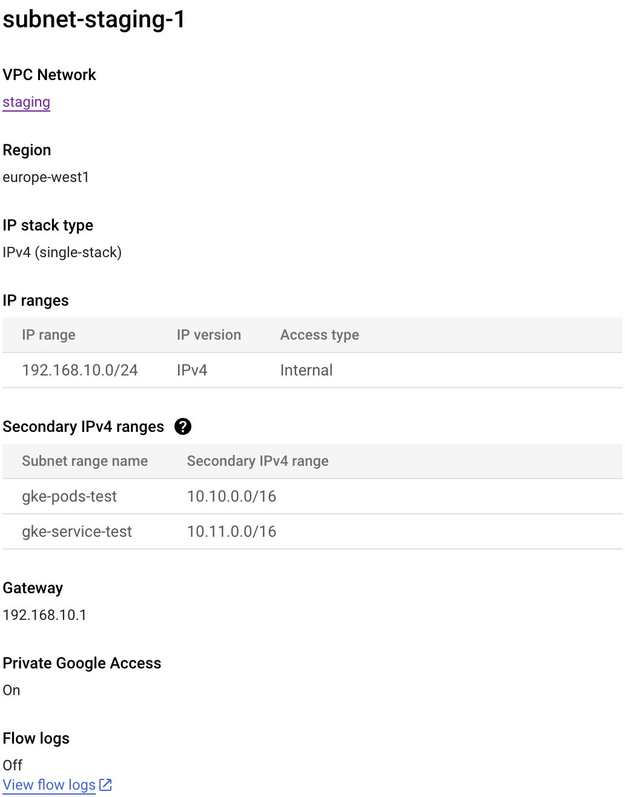

# Prerequisites

A VPC network needs to be setup, with a subnet that has two secondary IP ranges.

In the example, they are named `gke-pods-test` and `gke-service-test` but of course feel free to rename these.

Here is an example screenshot in the GCP console:

